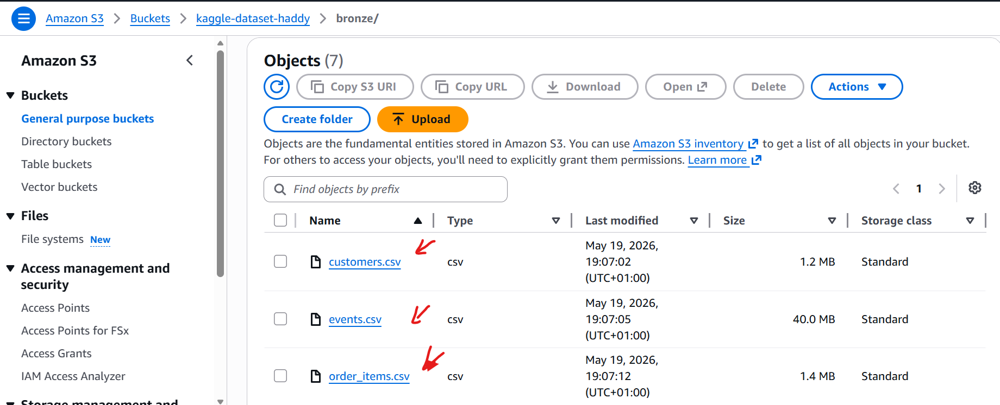
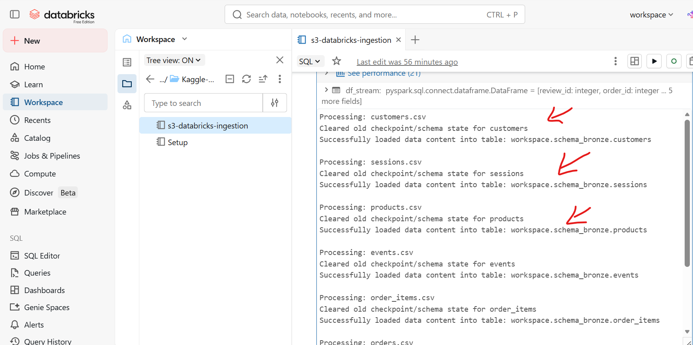
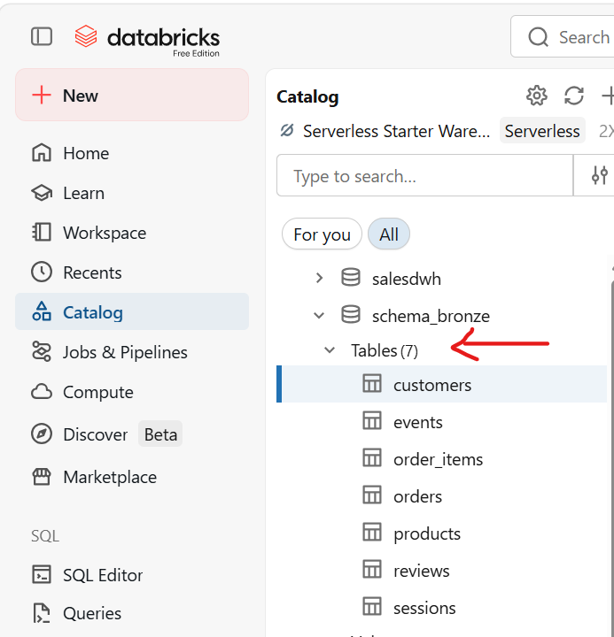
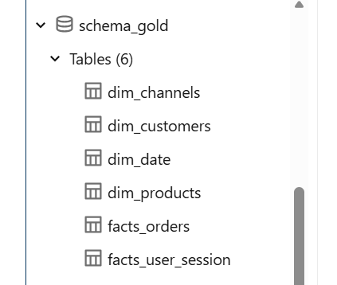

# E-Commerce Lakehouse Platform (Medallion Architecture)

## Project Overview
This project demonstrates the design and deployment of an end-to-end Data Lakehouse platform leveraging a **Medallion Architecture** (`Bronze` -> `Silver` -> `Gold`) built entirely on **Databricks Serverless Compute**, **AWS S3**, and **dbt Core**. 

The pipeline ingests multi-part e-commerce retail data streams from a Kaggle API endpoint, automates dynamic schema-isolated ingestion, transforms raw operational logs into clean dimensional models, and serves analytics-ready tables for business intelligence tracking.

---

## System Architecture (Phase 1)
The data platform is engineered with a completely decoupled storage and compute layer, utilizing zero-local-footprint serverless microservices:

```text
[ Kaggle API ] 
       │
       ▼ (Zero-Local-Footprint Streaming via Python/Boto3)         
[ AWS S3 Bucket: `kaggle-dataset-haddy/bronze/` ]
       │
       ▼ (Incremental Batch Loading via Auto Loader)
[ Databricks Serverless: `schema_bronze` ] (Raw Operational Logs)
       │
       ▼ (dbt Core Cleansing, Casting, & Normalization)
[ Databricks Serverless: `schema_silver` ] (Cleaned Staging Tables)
       │
       ▼ (dbt Core Star Schema Dimensional Modeling)
[ Databricks Serverless: `schema_gold`   ] (Analytics-Ready Marts)
```

See images below;







---

## Tech Stack
* **Cloud Infrastructure:** Amazon Web Services (S3, IAM)
* **Data Platform & Engine:** Databricks Serverless (Runtime 15.x+, Apache Spark)
* **Data Governance & Security:** Unity Catalog Managed Volumes
* **Inference Storage Format:** Delta Lake (Parquet-backed ACID transactions)
* **Languages:** Python (PySpark, Boto3, Urllib)

---

## Key Engineering Achievements & Blockade Resolutions

### 1. Fully Automated Multi-Table Ingestion Loop
* **The Challenge:** The source S3 storage bucket holds 7 distinct e-commerce entity files (`customers`, `sessions`, `products`, `events`, `order_items`, `order`, `reviews`) loose in a flat directory. Standard Auto Loader scripts gets strict, rigid sub-directories.
* **The Solution:** Engineered a dynamic Python orchestration loop using PySpark Structured Streaming. The script iteratively mounts the root S3 path, generates decoupled target metadata configurations, and uses a `pathGlobFilter` pattern to simultaneously extract, schema-infer, and isolate all 7 datasets into native, high-performance Delta tables inside the `Bronze` schema.

### 2. Overcoming Serverless Cloud Isolation & Security Restraints
* **The Challenge:** Migrating to modern **Databricks Serverless Compute** limits notebook permissions. Legacy Hadoop Spark session-level property declarations (`spark._jsc.hadoopConfiguration`) and old Root DBFS access paths (`dbfs:/`) are completely locked down and blocked (`SQLSTATE: 42K0I` / `56038`), preventing S3 credential mapping.
* **The Solution:** Bypassed the compute restrictions by implementing url-encoded IAM runtime string injections combined with session-level path routing. Wiped old corrupted pipeline states and routed streaming metadata checkpoints and schema evolution snapshots safely into managed **Unity Catalog Volumes** (`/Volumes/workspace/schema_bronze/bronzevolume/`).
  
### 3. Modularizing the Silver Transformation Layer via dbt Core (Phase 2)
* **The Challenge:** Moving from raw, untyped `Bronze` strings to structured data requires a scalable environment that isolates code from materialization logic, while running directly on high-performance compute.
* **The Solution:** Locally configured and integrated **dbt Core** connected via a Databricks Serverless SQL Warehouse. Refactored the raw structures by isolating reading routes strictly from `schema_bronze` and directing compiled physical table routing to a completely isolated `schema_silver` data layer. Implemented strict casting (standardizing timestamps and forcing monetary metrics to exact `decimal(10,2)` structures to prevent float-rounding bugs).

### 4. Proactive Data Governance & Handling Logical Anomalies (Phase 2)
* **The Challenge:** Real-world raw transactional data contains structural degradation that breaks downstream metrics if left unchecked.
* **The Solution:** Implemented an automated testing framework utilizing `dbt-utils`. The data quality suite captured critical business rule violations:
  * Detected **19,000+ anomalous records** where order item subtotals mathematically exceeded checkout totals.
  * Caught temporal anomalies where a customer's `signup_date` falsely trailed their `first_order_date` (due to timezone variance or guest checkouts).
  * **Resolution:** Engineered defensive transformation logic within `generated_customer_first_order.sql` and the staging layers using conditional SQL expressions (`case when` boundary capping and strict filtering) to self-heal anomalies automatically at runtime.

### 5. Architecting an Optimized Gold Analytics Layer & Star Schema (Phase 3)
* **The Challenge:** Staging layers are highly operational and fragmented. Querying them directly from business intelligence dashboards like Power BI or Tableau causes massive join overhead, slowing down executive reporting performance.

* **The Solution:** Architected a high-performance Star Schema (Facts & Dimensions) optimized for analytical read-velocity. Flattened transactional headers into centralized metrics, built descriptive Customer 360 registries, and implemented custom dbt routing using folder configuration parameters and custom macros to force materialization as physical Delta tables directly inside a dedicated schema_gold environment in Databricks.

### 6. Resolving Grain Duplication & Enforcing Referential Integrity (Phase 3)
* **The Challenge:** Initial data quality testing on the Gold layer caught critical primary key failures: unique_dim_products_product_id threw 1,074 duplicate failures due to catalog tracking duplicates, and generating surrogate tracking hashes across a granular customer-level marketing funnel caused multi-row key clashing.

* **The Solution:** Engineered a defensive modeling architecture:
* Pre-aggregated review scores inside a dedicated CTE by calculating the avg_review_rating per product prior to joining. This isolated the calculation and safely prevented grain duplication, ensuring that the master product_id remained unique even when a single item received multiple customer ratings.

* Extracted and aggregated web traffic clickstream logs inside dim_channels.sql using row_number() over (partition by customer_id order by session_started_at asc) to isolate the unique original customer acquisition channel contact.
* Enforced rigid data governance constraints using unique, not_null and accepted_values.
 
See images below;


---

## Gold Layer Data Model Directory Blueprint
The finalized analytical layer structures data into standard Kimball-modeled core matrices:

## Dimension Tables (dim_...)
* **dim_customers:* Master Customer 360 profile. Aggregates behavioral purchase metrics directly into descriptive demographics to provide Lifetime Value (LTV), order frequency, signup latency, and RFM consumer segmentation.

* **dim_products:* Unique inventory catalog registry. Houses cleaned names, review rating per product, and unit retail price metrics.

* **dim_channels:* Marketing funnel dimension mapping user acquisition paths back to strategic buckets (Paid Social, Paid Search, Email Marketing, Organic/Inbound).

* **dim_date:* Time-intelligence calendar matrix generated using dbt-utils spines, enabling seamless analysis of weekend vs. weekday consumer activity and seasonal metrics.

## Fact Tables (fact_...)
* **fact_orders:* Central transactional ledger capturing real-time sales velocity, item counts, unit prices, recalculated line-subtotals, and logistics order lifecycle states.

* **fact_user_sessions:* Clickstream behavioral engine aggregating event interaction journeys to expose page views, and cart additions per session.

---

## Directory Layout
```text
ecommerce_lakehouse_pipeline/
├── databricks_notebooks/      # Phase 1: Python/PySpark Ingestion Scripts
├── ingestion_architecture/    # System configuration mappings
└── ecommerce_lakehouse_dbt/   # Phase 2 & 3: Complete dbt Core Workspace
    ├── macros/
    │   └── generate_schema_name.sql # Custom overriding macro for direct schema target isolation
    ├── models/
    │   ├── staging/           # Silver Layer: Staging models & custom schema validations
    │   └── marts/
    │       └── core/          # Gold Layer: Star-schema models and companion tests
    │           ├── dim_channels.sql   # Marketing acquisition touchpoints model
    │           ├── dim_customers.sql  # Customer 360 RFM profile model
    │           ├── dim_date.sql       # Automated calendar date model
    │           ├── dim_products.sql   # Deduplicated product master model
    │           ├── fact_orders.sql    # Central transactional ledger
    │           └── fact_user_session.sql # Behavioral clickstream session model
    │   ├── schema.yml         # Automated data quality checks & columns descriptions
    │   ├── sources.yml           # Data Source
    ├── dbt_project.yml        # Core framework configurations & target schema configurations
    └── packages.yml           # External open-source testing dependencies (dbt utils)
```

## Pipeline Execution & Verification Commands
To test, compile, and run the complete Medallion Architecture data warehouse pipeline locally or inside an orchestrator:
#### 1. Verify connection connectivity from local dbt setup to Databricks Serverless
dbt debug

#### 2. Re-compile the macro configurations and DAG dependency graph
dbt compile

#### 3. Execute transformations and materialize tables across Silver and Gold layers
dbt run

#### 4. Trigger the data validation testing suite to confirm data integrity
dbt test


## Current Progress & Next Steps
- [x] Phase 1: Establish AWS S3 data lake destinations.
- [x] Phase 1: Configure Databricks Auto Loader pipeline for real-time batch synchronization.
- [x] Phase 1: Lands 7 operational tables successfully into the `Bronze` Schema layer.
- [x] Phase 2: Connect **dbt Core** locally via Databricks SQL Warehouses / Personal Compute.
- [x] Phase 2: Build out the `Silver` layer (cleaning, deduplication, timestamp normalization).
- [x] Phase 2: Implement automated testing/data quality check and handle real-world logical data anomalies.
- [x] Phase 3: Architect the `Gold` layer dimensional star-schema models (Facts and Dimensions).
- [x] Phase 3: Enforce custom data routing directly into a dedicated Databricks schema_gold environment.
- [x] Phase 3: Debug and resolve grain replication anomalies through robust dbt assertion testing.
